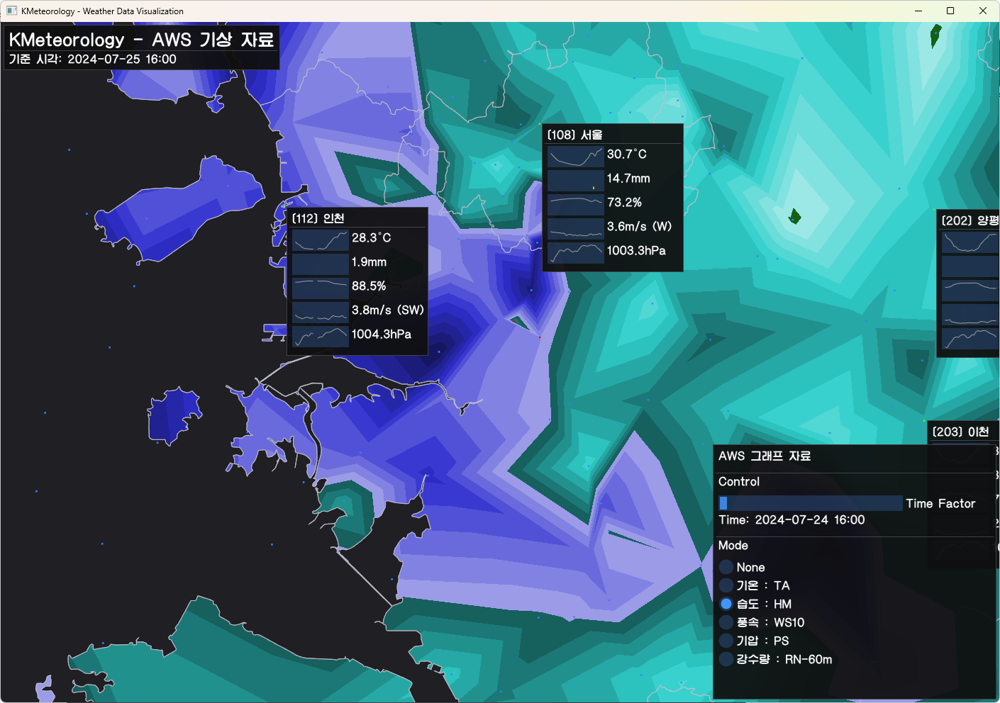
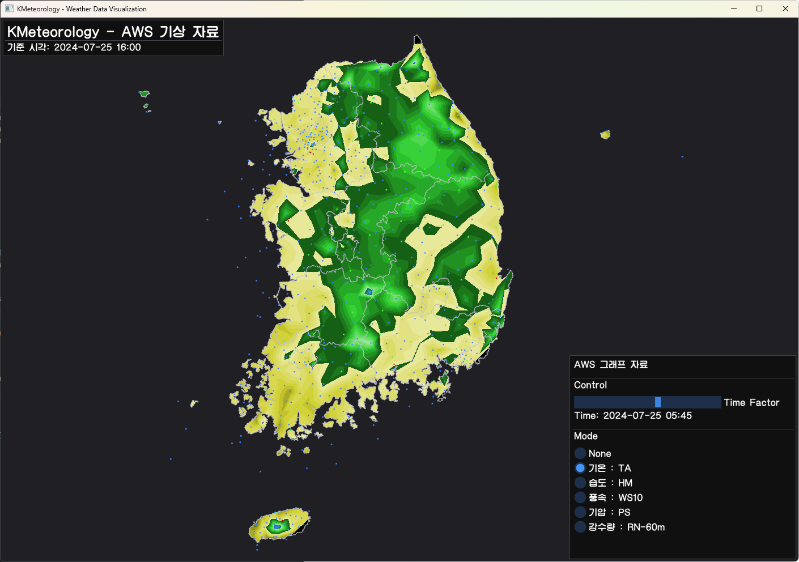

# KMeteorology

## Overview
KMeteorology is a project aimed at visualizing meteorological data from the Korea Meteorological Administration (KMA). This project is written in Python and is designed to be user-friendly, allowing easy access and visualization of weather data.

## Features
- Visualization of various meteorological data points

## Screenshots

